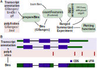

# diffUTR

## Streamlining differential exon and 3' UTR usage analysis

The _diffUTR_ R package streamlines differential exon usage (DEU) analyses, and leverages existing DEU tools and alternative poly-adenylation site databases to enable differential 3' UTR usage analysis.



Popular bin-based DEU methods are provided by the [limma](https://bioconductor.org/packages/release/bioc/html/limma.html), [edgeR](https://bioconductor.org/packages/release/bioc/html/edgeR.html) and in particular [DEXSeq](https://bioconductor.org/packages/release/bioc/html/DEXSeq.html) packages. However, their usage is not straightforward for non-experienced users, and their results often difficult to interpret. We therefore developed a simple workflow (Figure 1A), usable with any of the three methods but standardizing inputs and outputs. In particular, bin annotation and quantification, as well as different usage results, are all stored in a [RangedSummarizedExperiment](https://www.bioconductor.org/packages/devel/bioc/vignettes/SummarizedExperiment/inst/doc/SummarizedExperiment.html), which facilitates data storage and exploration, and enables advanced plotting functions irrespective of the underlying method. _diffUTR_ also provides an improved version of the `limma::diffSplice` method.

In addition, _diffUTR_ allows the extension of the DEU framework to UTR usage. A chief difficulty here is that most UTR variants are not catalogued in standard transcript annotations, limiting the utility of standard transcript-level quantification based on reference transcripts. However, based on databases of poly-adenylation (APA) sites such as [polyASite](https://polyasite.unibas.ch), _diffUTR_ can use alternative APA sites to further segment and extend UTR bins, as illustrated in Figure 1B. In this way, _diffUTR_ outperforms current methods for detecting UTR changes from standard transcriptomics.

Finally, _diffUTR_ provides a number of plotting functionalities (see the vignette for more details), compatible with the results of any of the three underlying statistical methods.

## Installation

```{r}
BiocManager::install("ETHZ-INS/diffUTR")
```
See the vignette for more details!
